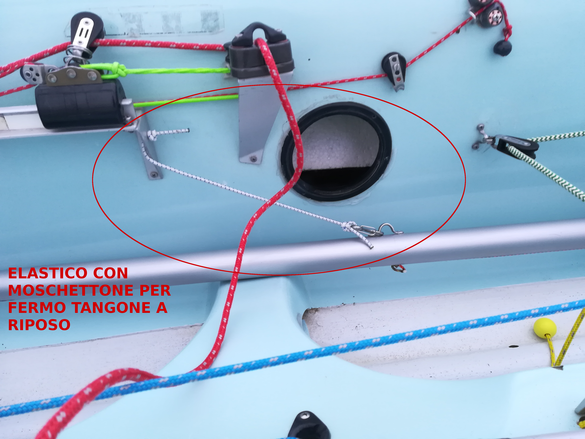
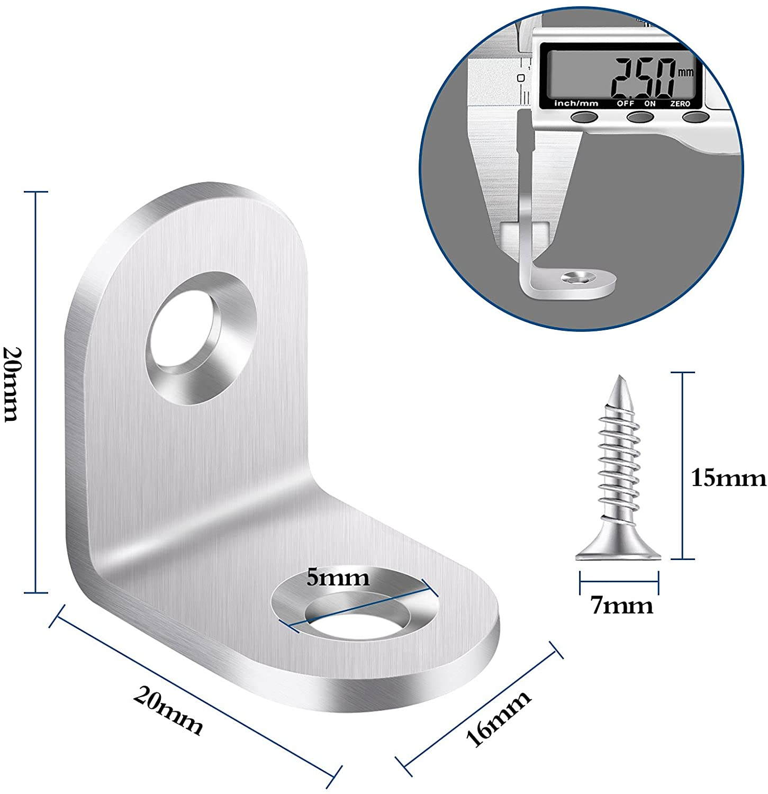

# Lavori

## Timone

Ho messo un nuovo strozzatore per la ritenuta della pala sollevata

ho fatto l'anti-sdrucciolo dello stick con nastro gommato per le racchette da tennis

## Deriva

Ho sostituito il bozzello piano fissato sul trasto randa, che oltrettutto è abbastanza distrutto,

con un bozzello normale, recuperato, fissato con un anello in tessile bloccato sotto il trasto.

Cosi' orientato il bozzello di sicuro lavora meglio e abbassa di qualche centimetro il rimando della cima che non dovrebbe più sfregare sulla scassa della deriva. Lo stesso intervento lo vorrei fare a dritta, sostituzione bozzello e anello in tessile. Da rivedere la lunghezza dell'anello in tessile.

## Circuito SPI

Ho sostituito un bozzello rotto del circuito SPI con un altro recuperato

## Tangone

Visto il salvataggio in extremis del tangone, dell'ultima volta, ho pensato di fare un sistema più sicuro e più pratico. Ho fissato un elastico alla staffa del carrello del fiocco e all'altra estremità ho messo un moschettone da agganciare al ponticello del tangone quando si mette a riposo

Inoltre ho messo un elastico teso sotto il trasto randa che serve da guida, quando lo si ripone durante l'ammainata, ed che eviti che si sposti durante la navigazione 

## Ghinda

Ho spostato la ghinda del fiocco da sinistra a dritta. Come avevamo constatato, a sinistra c'erano troppe cose con il rischio che lavorassero male interferento a vicenda. Per il momento ho riusato tutti i componenti già impiegati nel circuito e ho fissato il cavo d'acciaio come era fissato prima semplicemente utilizzando il bullone del trasto di dritta invece che quello di sinistra.

Ora mi sembra che tutto scorra meglio.

L'ho tenuta qualche ora ghindata per essere sicuro che tutto tenesse.

## Altro

In generale ho rivisto il bozzello di risalita delle deriva che adesso è fissato ad una cima legata al piede d'albero, spero che dia al bozzello un angolo migliore di lavoro. Ho sostituito qualche altro bozzello distrutto con alcuni nuovi. Dove sono intervenuto ho sostituito i dati normali con quelli autobloccanti e cambiato tuttle le rondelle che erano completamente ossidate dal sale. Ho lubrificato molti bozzelli e paranchi

## Da fare

Secondo me i prossimi passi da fare sono i seguenti

### Miglioramenti circuito wang

Recuprendo il bozzello piano del circuito deriva

ho fatto una prova e l'ho fissato sotto la scassa della deriva

La cima del paranco del wang esce in linea per essere rimandata sulla murata così da essere governata comodamente.

Di seguito l'esempio preso dal 470 del circolo

Per quanto riguarda lo strozzatore del wang io utilizzerei lo stesso meccanismo che c'e' nel 470 del circolo con il fissaggio sulla scassa della deriva di un supporto a L, i buchi già esistono, dove poggiare e fissare lo strozzatore che intercetta la cima del paranco in uscita dalla scassa dopo il rimando del bozzello piano presente sotto la scassa.

Esiste un componente harken che riassume il tutto ma costa un occhio della testa (come al solito), codice componente 197

Pertanto proverei a fare tutto artigianalmente utilizzando una cosa del genere come staffe

Prodotto su [Amazon](https://www.amazon.it/Angolari-Bolatus-Bretelle-Giunzione-Parentesi/dp/B08BFMF3ZS/ref=sr_1_10?__mk_it_IT=%C3%85M%C3%85%C5%BD%C3%95%C3%91&crid=1RWB3QSBQG4W7&keywords=Staffa+angolare+in+acciaio+inossidabile+20x20+10+pezzi&qid=1641291586&sprefix=staffa+angolare+in+acciaio+inossidabile+20x20+10+pezzi%2Caps%2C93&sr=8-10).

e come strozzatore il 25.10 della viadana

Ovviamente il bozzello piano andrebbe sostituito con uno nuovo e io prenderei il viadana 11.71

